# Blog Thing
SmartyAnts Phonics Pupper

Some Random Drone I Scavenged

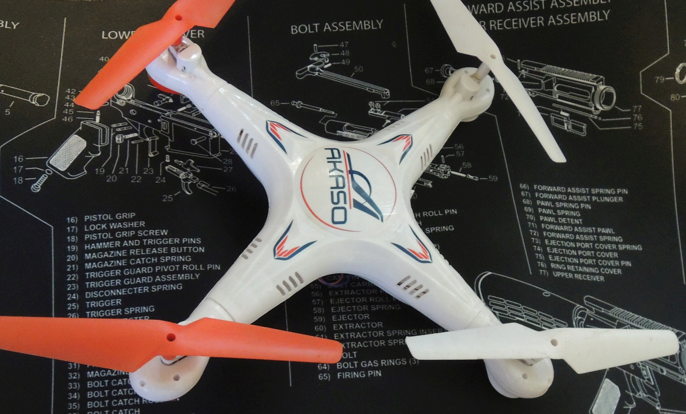{:height="50%" width="50%"}

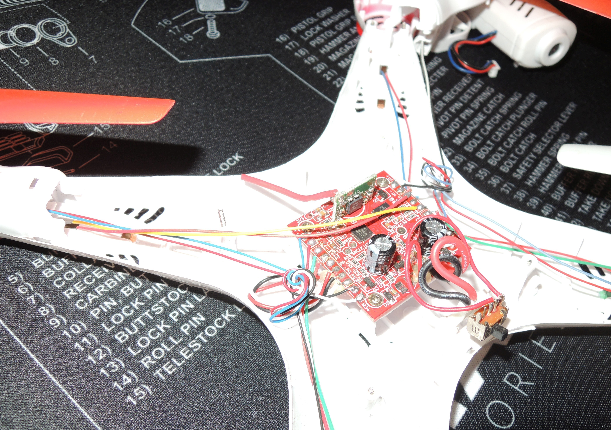{:height="50%" width="50%"}

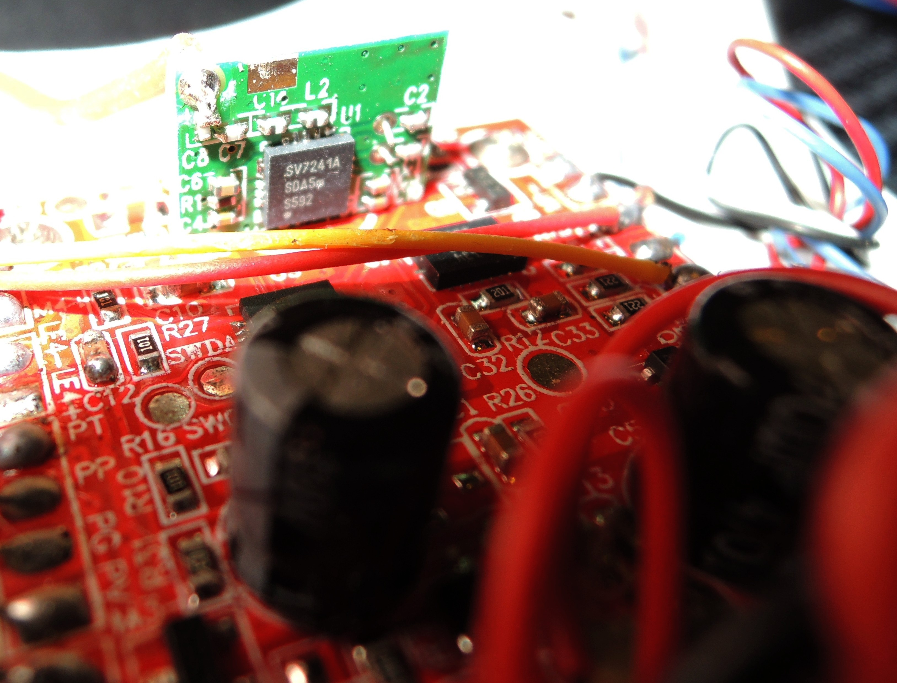{:height="50%" width="50%"}

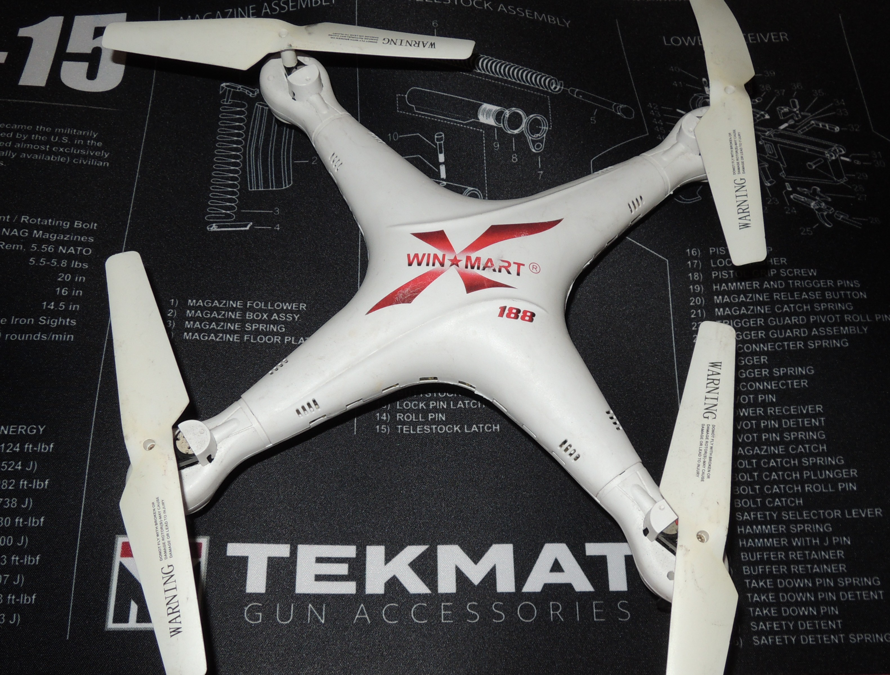{:height="50%" width="50%"}

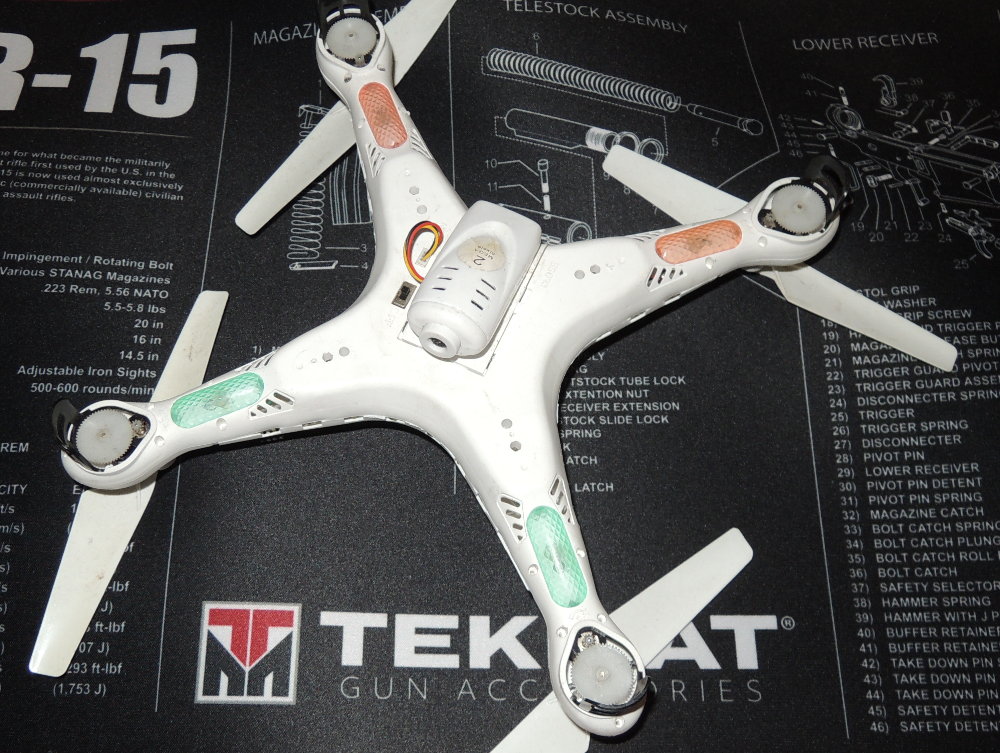{:height="50%" width="50%"}

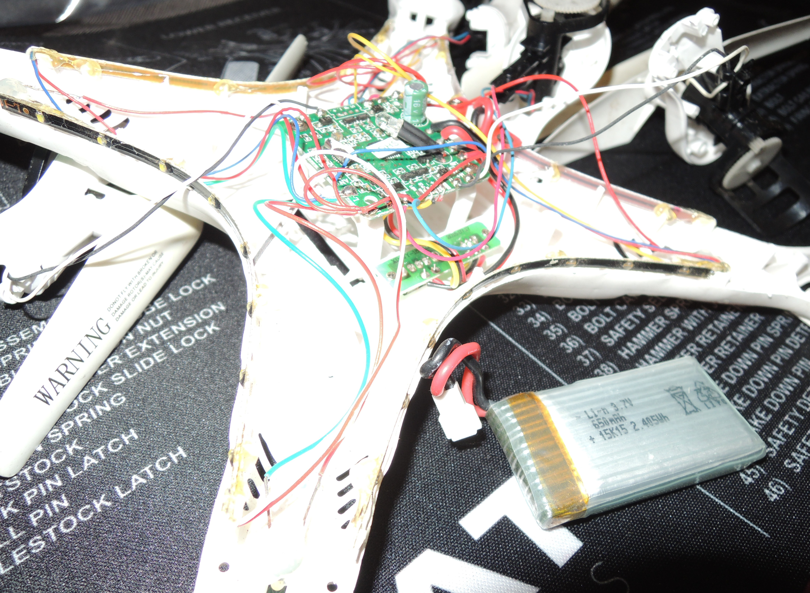{:height="50%" width="50%"}

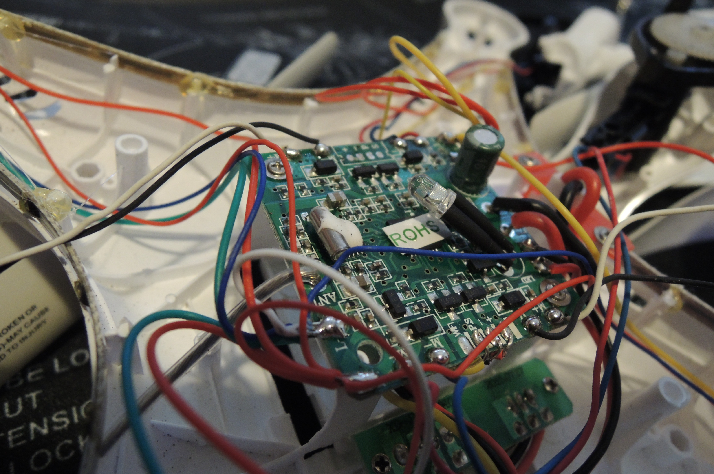{:height="50%" width="50%"}

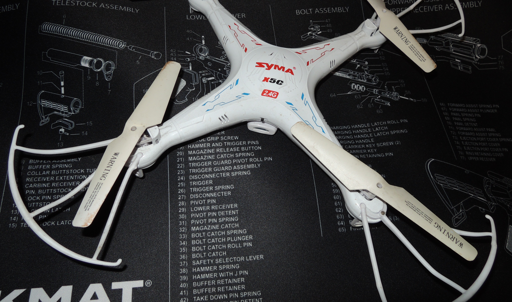{:height="50%" width="50%"}

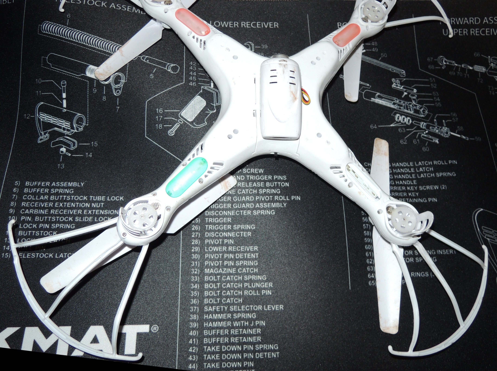{:height="50%" width="50%"}

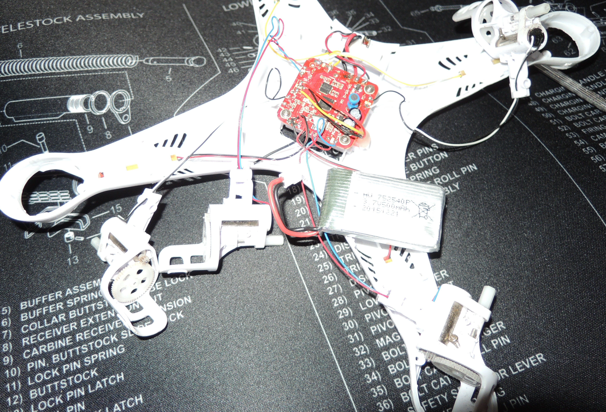{:height="50%" width="50%"}

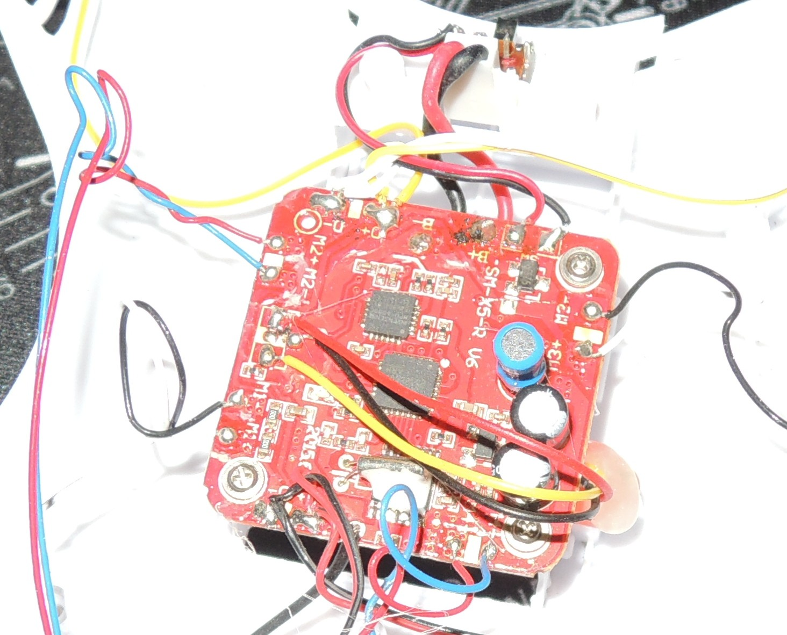{:height="50%" width="50%"}
