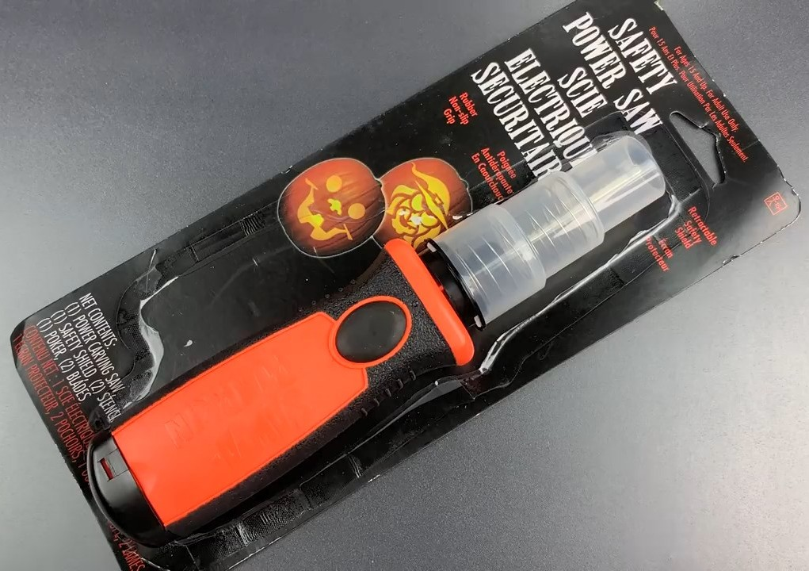
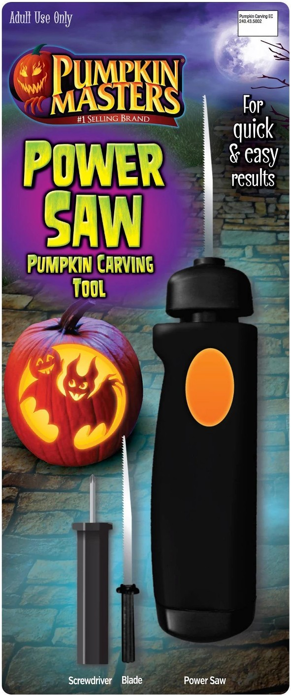
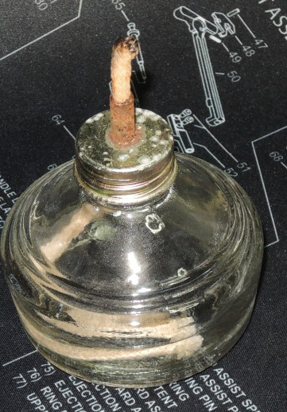
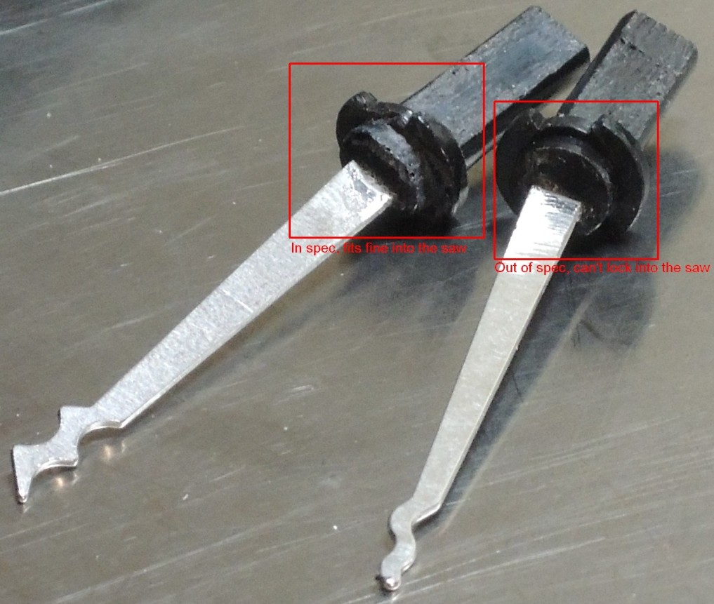
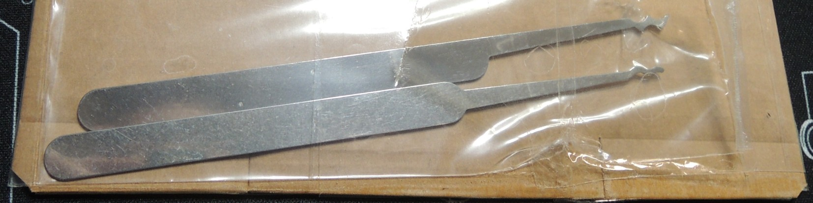

# Peer Review

## The Pumpkin Saw

We don't have whatever brand of pumpkin saw that LPL was using in his video, and the one we got seems pretty inferior, leading to a questionable build.

His Saw:

{:height="70%" width="70%"}

Our Saw:

{:height="50%" width="50%"}

First off, this saw has a battery cover so poorly engineered that it comes with its own mini screwdriver to open and close it, and the pressure it takes to close it when all 4 batteries are inserted is, ah, A FIRM GRIP. It's not clear why they didn't just give it a solid latch instead of going to the trouble to include another screwdriver.

The saws took more heat to unseat from the saw plugs than they took in LPL's video, and so we had to use an alcohol burner that we had handy, because a gas station bic lighter just didn't cut it.

{:height="40%" width="40%"}

The tolerances between the saw plug and the retaining collar are pretty tight, so you can't attach the plug if it deformed even a little under the heat.

{:height="95%" width="95%"}

As you can see, that looks exactly backwards.

We ordered the lockpicks from SouthOrd, who sells single replacement picks. Lockpickshop supposedly does too, but they have a hidden minimum order that they only tell you about after they have your money. To cut the picks, we used the wire cutter on some cheap dollar store pliers. The cut picks did technically fit the plugs, but filing them down made them fit better.

{:height="85%" width="85%"}

Total cost per saw:

The Saw Itself: $10 from Michael's Crafts ($7 at Target)

2 Rake Picks, plus shipping: $5.00

Alcohol Burner: We had it already, otherwise it cost $13, BYOB

4 AA Batteries: We stole these out of our radio scanner. Probably $1 from a dollar store.

Does it work? Well, it moves the rake in and out.
